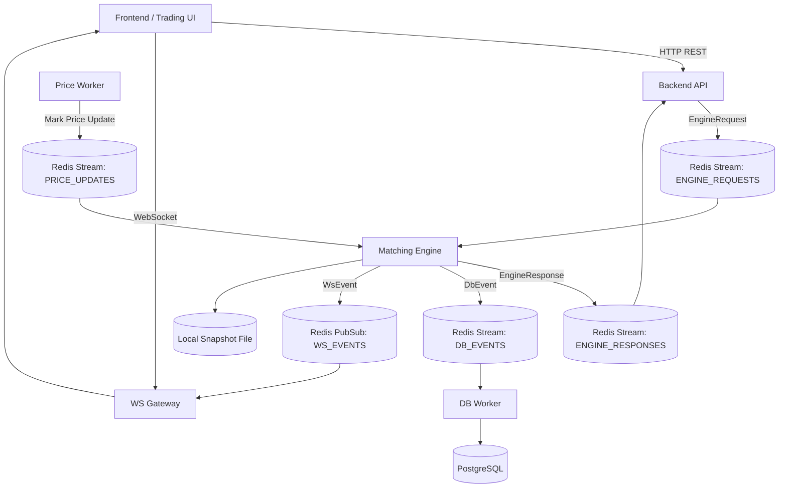
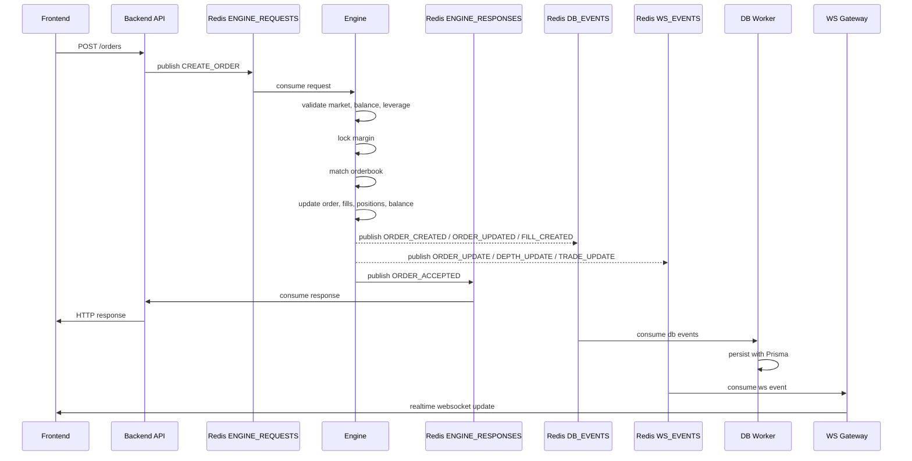
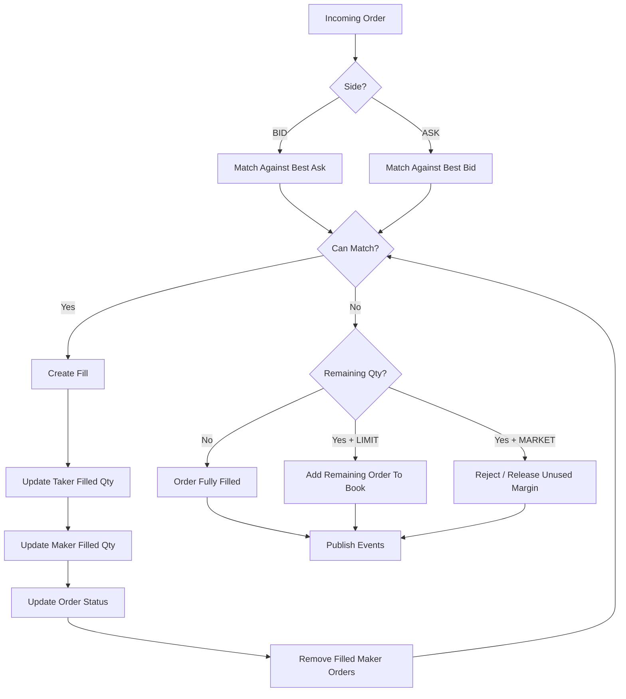
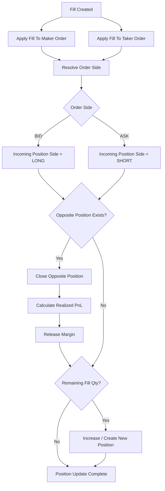
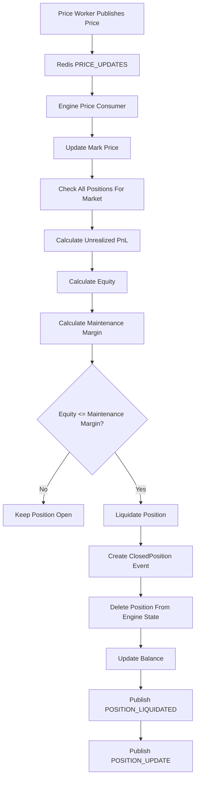
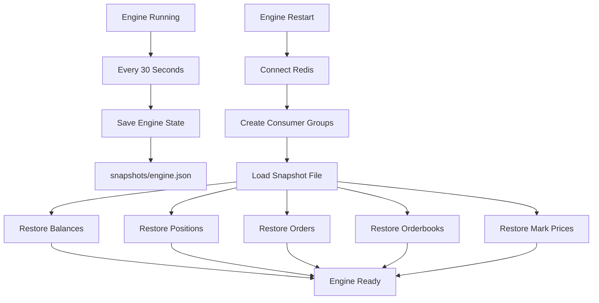
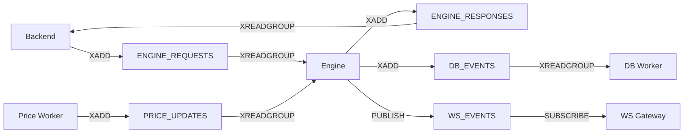
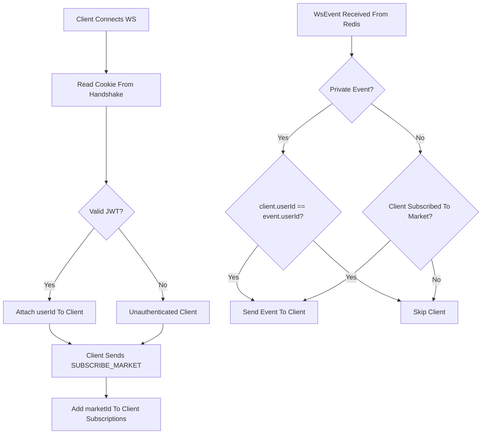

# Perps V2

A simplified perpetual futures exchange built from scratch using:

- Next.js Frontend
- Express Backend
- Matching Engine
- Redis Streams
- Redis Pub/Sub
- PostgreSQL
- Prisma
- WebSocket Gateway
- Snapshot Recovery

---

# Architecture

```text
                    ┌─────────────┐
                    │  Frontend   │
                    └──────┬──────┘
                           │
                    HTTP / WS
                           │
                           ▼
                    ┌─────────────┐
                    │   Backend   │
                    └──────┬──────┘
                           │
                EngineRequest Stream
                           │
                           ▼
                    ┌─────────────┐
                    │   Engine    │
                    └──────┬──────┘
                           │
         ┌─────────────────┼─────────────────┐
         │                 │                 │
         ▼                 ▼                 ▼
  EngineResponse     DbEvent Stream     WsEvent PubSub
         │                 │                 │
         ▼                 ▼                 ▼
      Backend         DB Worker        WS Gateway
                           │                 │
                           ▼                 ▼
                      PostgreSQL        WebSocket
```

---

# Services

## Backend

Responsibilities:

- Authentication
- Validation
- HTTP APIs
- Send Engine Requests
- Wait for Engine Response
- Return Response

Backend never modifies:

- balances
- orders
- positions
- orderbooks

Only Engine owns state.

---

## Engine

The Engine is the source of truth.

Responsible for:

- Balance management
- Order creation
- Order cancellation
- Matching
- Position tracking
- Liquidation
- Depth generation
- Snapshot recovery

State lives entirely in memory.

```ts
balances
positions
orders
orderbooks
markPrices
```

---

## DB Worker

Responsible for persistence only.

Consumes:

```text
STREAMS.DB_EVENTS
```

Writes:

```text
PostgreSQL
```

DB Worker never contains business logic.

---

## WS Gateway

Responsible for realtime updates.

Consumes:

```text
CHANNELS.WS_EVENTS
```

Broadcasts:

```text
WebSocket Clients
```

---

# Request Flow

## Create Order

```text
Frontend
   │
   ▼
Backend
   │
   ▼
ENGINE_REQUESTS
   │
   ▼
Engine
   │
   ├── Match Orders
   ├── Update Balances
   ├── Update Positions
   ├── Generate Fills
   │
   ▼
ENGINE_RESPONSES
   │
   ▼
Backend
   │
   ▼
Frontend
```

---

# Persistence Flow

Whenever Engine changes state:

```text
Engine
   │
   ▼
publishDbEvent()
   │
   ▼
DB_EVENTS
   │
   ▼
DB Worker
   │
   ▼
Postgres
```

Examples:

```text
ORDER_CREATED
ORDER_UPDATED
FILL_CREATED
BALANCE_UPDATED
CLOSED_POSITION_CREATED
```

---

# Realtime Flow

Whenever Engine changes state:

```text
Engine
   │
   ▼
publishWsEvent()
   │
   ▼
Redis PubSub
   │
   ▼
WS Gateway
   │
   ▼
Clients
```

Examples:

```text
DEPTH_UPDATE
TRADE_UPDATE
ORDER_UPDATE
BALANCE_UPDATE
POSITION_UPDATE
MARK_PRICE_UPDATE
POSITION_LIQUIDATED
```

---

# Engine State

```ts
balances: Record<string, UserBalance>

positions: Record<string, Position>

orders: Record<string, Order>

orderbooks: Record<string, Orderbook>

markPrices: Record<string, number>
```

---

# Orderbook

Each market owns one orderbook.

```ts
type Orderbook = {
  marketId: string;

  bids: Record<number, Order[]>;

  asks: Record<number, Order[]>;
};
```

Example:

```ts
bids = {
  100000: [order1, order2],
  99900: [order3]
};

asks = {
  100100: [order4],
  100200: [order5]
};
```

---

# Matching Engine

Price-Time Priority (FIFO)

### Buy Order

```text
Match Lowest Ask First
```

### Sell Order

```text
Match Highest Bid First
```

Example:

```text
Bid 100
Bid 99

Ask 101
Ask 102
```

Incoming:

```text
BUY LIMIT 101
```

Matches:

```text
Ask 101
```

first.

---

# Position Logic

### BID

Creates:

```text
LONG
```

### ASK

Creates:

```text
SHORT
```

---

## Position Increase

Existing:

```text
LONG 1 BTC @ 100
```

New Fill:

```text
LONG 1 BTC @ 110
```

Result:

```text
LONG 2 BTC @ 105
```

Weighted average entry.

---

## Position Close

Existing:

```text
LONG 2 BTC @ 100
```

Sell:

```text
1 BTC @ 120
```

Realized:

```text
+20
```

Position:

```text
LONG 1 BTC @ 100
```

---

# PnL

## Unrealized

LONG

```text
(markPrice - entryPrice) * qty
```

SHORT

```text
(entryPrice - markPrice) * qty
```

---

## Equity

```text
margin + unrealizedPnL
```

---

## Maintenance Margin

```text
margin * 10%
```

---

# Liquidation

Triggered by:

```text
Price Worker
```

Flow:

```text
Price Update
      │
      ▼
Update Mark Price
      │
      ▼
Check Equity
      │
      ▼
Equity <= Maintenance Margin
      │
      ▼
Liquidate
```

Engine:

```text
Delete Position
Release Margin
Create ClosedPosition
Publish Events
```

---

# Market Orders

Market order:

```text
Match Immediately
```

Unfilled quantity:

```text
Margin Returned
```

No liquidity:

```text
ORDER_REJECTED
```

---

# Limit Orders

Limit order:

```text
Try Match
```

Remaining quantity:

```text
Added To Orderbook
```

---

# Snapshot System

Every 30 seconds:

```text
Engine State
      │
      ▼
engine.json
```

Saved:

```ts
balances
positions
orders
orderbooks
markPrices
```

---

## Startup Recovery

```text
Engine Start
      │
      ▼
Load Snapshot
      │
      ▼
Restore State
```

---

# Redis Usage

## Streams

Used for reliable processing.

```text
ENGINE_REQUESTS
ENGINE_RESPONSES
DB_EVENTS
PRICE_UPDATES
```

---

## PubSub

Used for realtime delivery.

```text
WS_EVENTS
```

---

# Database Models

Implemented:

```text
User
Balance
Order
Fill
ClosedPosition
```

Removed:

```text
Position
```

Positions only exist inside Engine memory.

Historical closed positions are persisted.

---

# WebSocket Authentication

Client connects:

```text
ws://localhost:3002
```

Cookie:

```text
token=<jwt>
```

Gateway:

```text
verifyToken()
```

Stores:

```ts
client.userId
```

---

# Market Subscription

Subscribe:

```json
{
  "type": "SUBSCRIBE_MARKET",
  "marketId": "BTCUSDT"
}
```

Unsubscribe:

```json
{
  "type": "UNSUBSCRIBE_MARKET",
  "marketId": "BTCUSDT"
}
```

---

# Event Visibility

## Public

Everyone subscribed to market:

```text
DEPTH_UPDATE
TRADE_UPDATE
MARK_PRICE_UPDATE
```

---

## Private

Only owner receives:

```text
ORDER_UPDATE
BALANCE_UPDATE
POSITION_UPDATE
POSITION_LIQUIDATED
```

---

# Current Features

- On Ramp

- Create Order

- Cancel Order

- Orderbook

- Matching Engine

- Fill Generation

- Position Tracking

- Realized PnL

- Unrealized PnL

- Liquidation

- Depth Generation

- Redis Streams

- Redis PubSub

- Snapshot Recovery

- PostgreSQL Persistence

- WebSocket Updates

- Multi Market Support

---

# Future Improvements

- Take Profit
- Funding Rate
- Isolated Margin
- Mark Price Formula
- Multi Engine Sharding
- Multi Market Workers
- Risk Engine
- Admin Panel
- KYC
- Deposits
- Withdrawals
- Rate Limiting
- Horizontal Scaling

## Mermaid Architecture Diagrams

### 1. High-Level System Architecture



---

### 2. Create Order Flow



---

### 3. Matching Engine Flow



---

### 4. Position Engine Flow



---

### 5. Liquidation Flow



---

### 6. Snapshot Recovery Flow



---

### 7. Redis Streams and PubSub



---

### 8. WebSocket Broadcast Logic

