Here are safe Mermaid diagrams you can paste directly into README.

## 1. High-level architecture

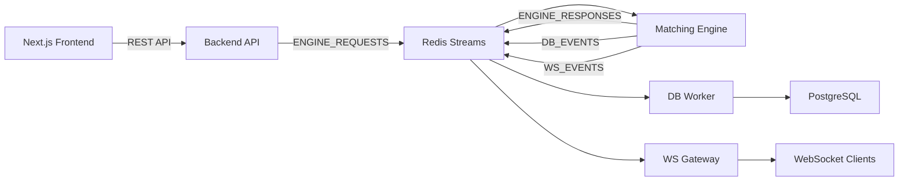
---

2. Order creation flow

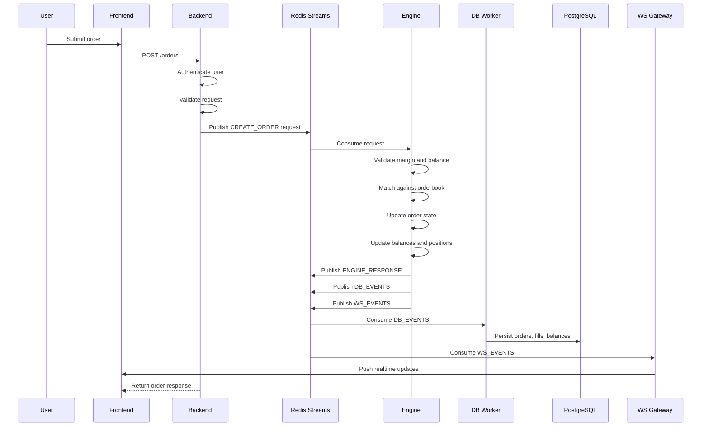
---

3. Engine internal flow
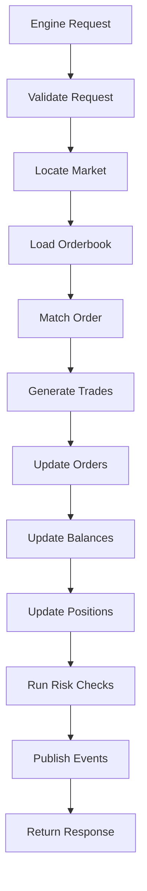
---

4. Orderbook matching flow
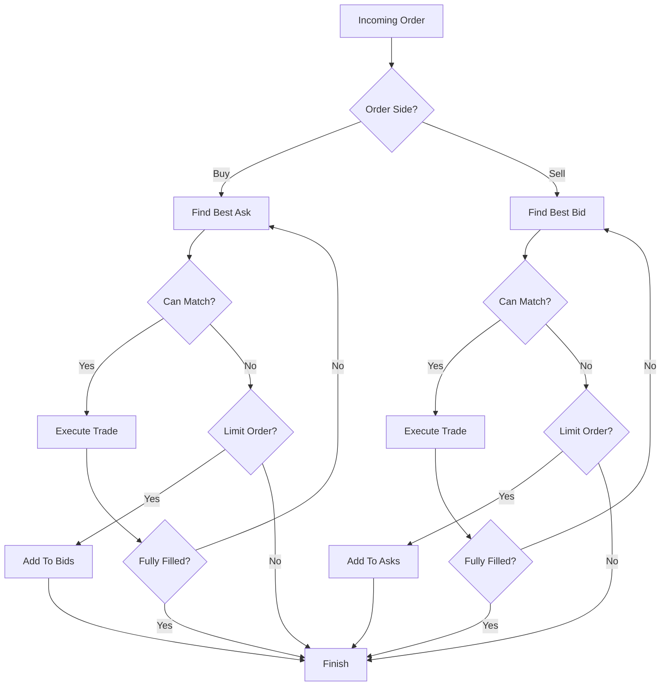
---

5. Position lifecycle
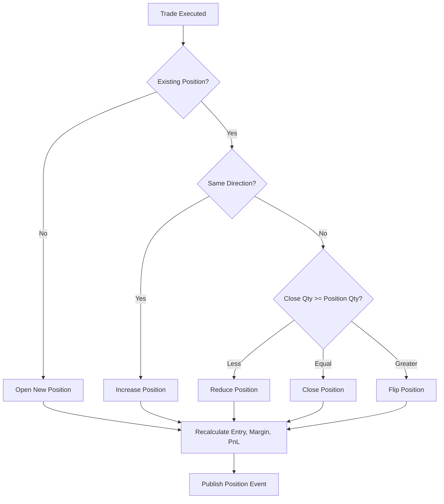
---
6. Liquidation flow
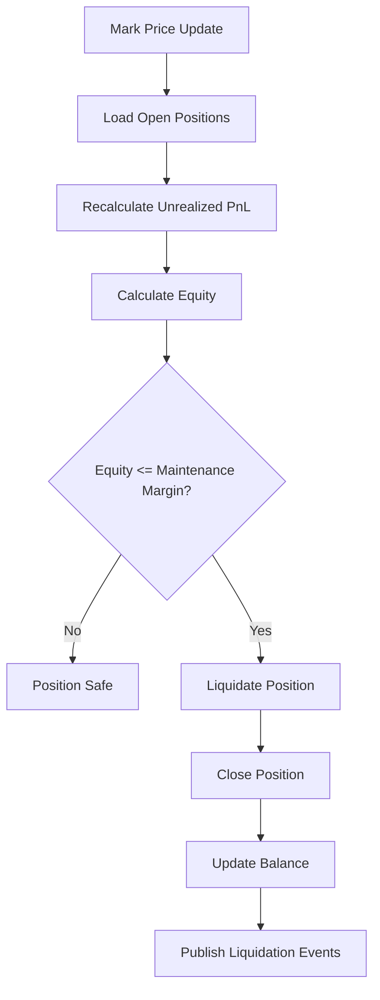
---

7. Redis streams architecture
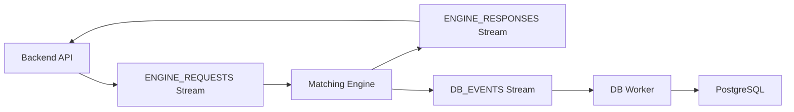
---
8. WebSocket event architecture
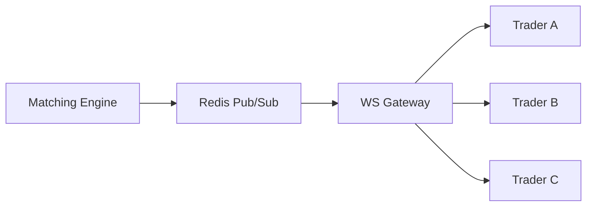
---
9. Authentication architecture

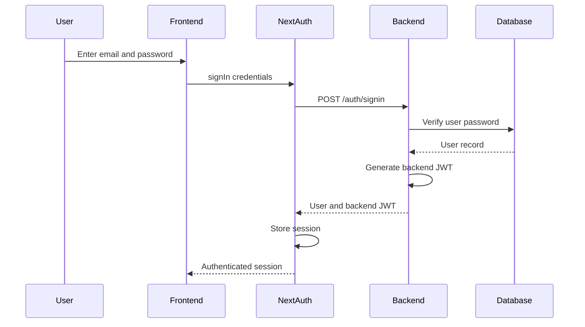
---
10. API authentication flow

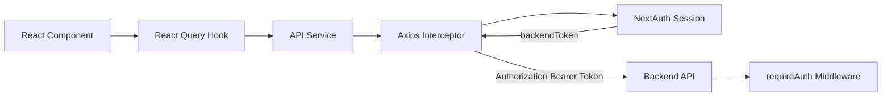
---
11. WebSocket authentication flow
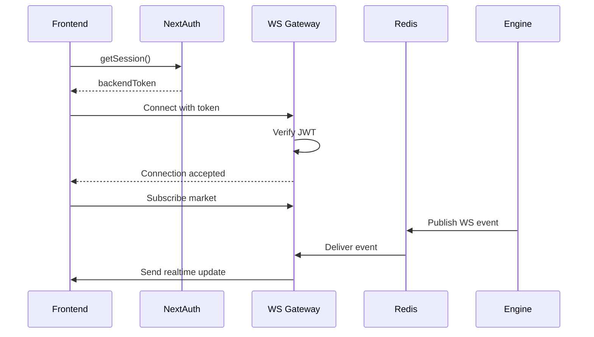
---
12. Frontend data flow
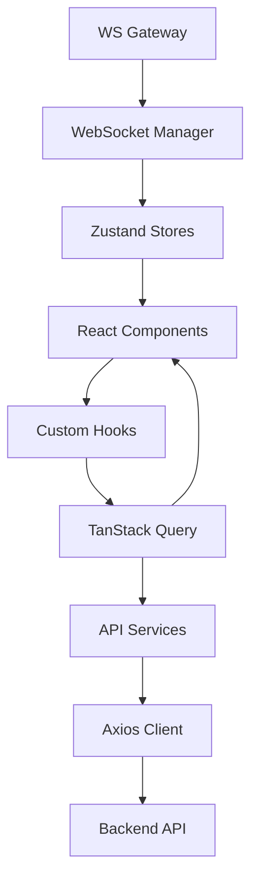
---
13. Deployment architecture
```mermaid
flowchart LR
    Users["Users"]
    Frontend["Frontend"]
    Backend["Backend API"]
    Redis["Redis"]
    Engine["Engine"]
    DBWorker["DB Worker"]
    WSGateway["WS Gateway"]
    PriceWorker["Price Worker"]
    Postgres["PostgreSQL"]
    Users --> Frontend
    Frontend --> Backend
    Frontend --> WSGateway
    Backend --> Redis
    Redis --> Engine
    PriceWorker --> Redis
    Engine --> Redis
    Redis --> DBWorker
    Redis --> WSGateway
    DBWorker --> Postgres
    ```
